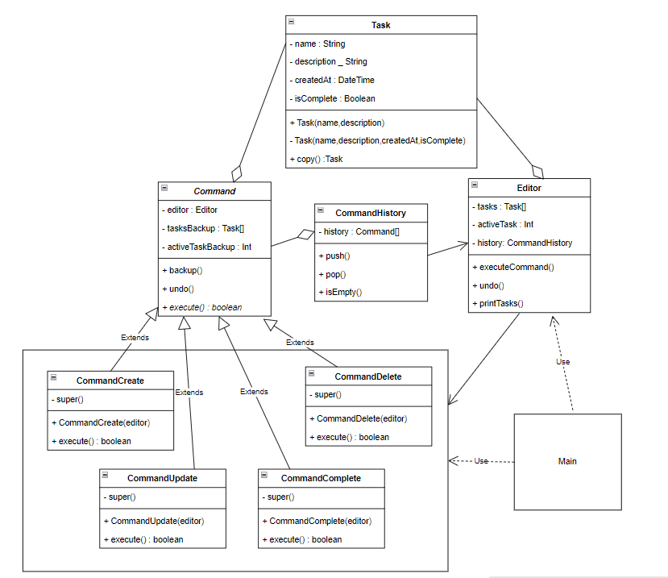
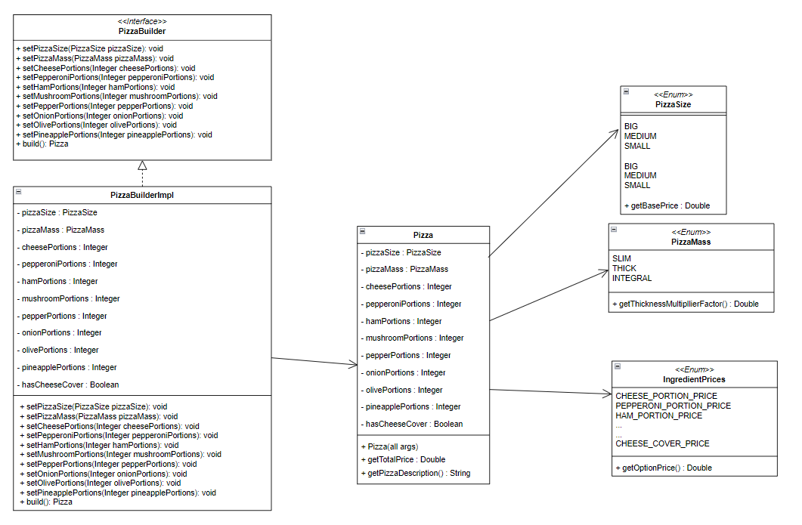
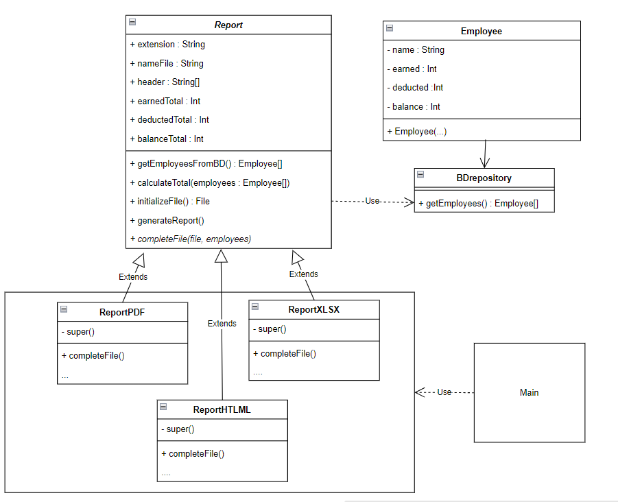
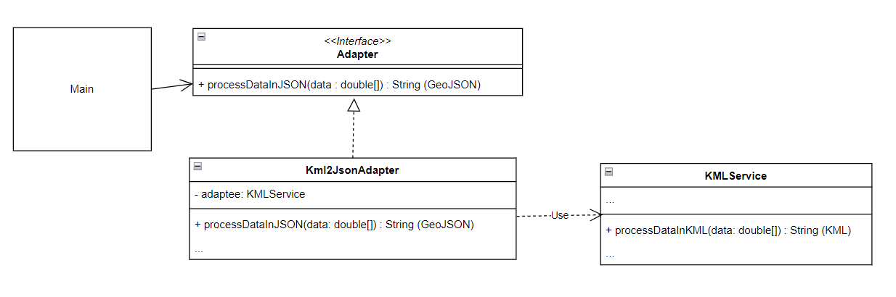

# Actividad de Patrones de Software Grupo 1 (Java)
# Integrantes del equipo:

Andres Felipe Carrion Pastrana

Carlos Andres Fuentes Sandoval

Danuil Fernando Gomez Naranjo

Jehison Julian Gelvez Lagos

Juan Felipe Gonzalez Ortiz

Juan Toledo

# Configuración del source folder:
Una vez se haya clonado el repositorio asegurarse que el folder src este marcado como Source root
En caso contrario dar click derecho sobre este y buscar la opcion Mark Directory as o Marcar Directorio Como y dar la opcion de source root.

# Ejercicio 1: Sistema de Gestión de Tareas
### Problema
Imagina un sistema de gestión de tareas en el que los usuarios pueden crear, editar, eliminar y completar tareas. 
Cada acción realizada por el usuario corresponde a una acción que debe ser ejecutado. 
Además, es importante mantener un registro de todas las acciones realizadas para permitir la reversión de las mismas si es necesario.

### Aplicación del Patrón:
En este escenario, el patrón será aplicado para encapsular cada una de las acciones que el usuario puede realizar sobre una tarea.

### Requerimientos:
* Desacopla el invocador de los objetos que realizan las acciones.
* Permite la extensión de nuevas operaciones sin modificar el código existente.
* Facilita el registro de acciones para realizar operaciones de reversión.

### Implementación 

Para la resolución del ejercicio No. 1 se empleó un patrón de diseño Command, en cual obedece a problemas de comportamiento.

### Uso
La implementación funciona ejecutando la clase Exercise1Main.java, la cual posee una interfaz de linea de comandos y presenta las siguientes opciones:

* Opción C --> Crear una tarea
* Opción U --> Actualizar una tarea
* Opción D --> Borrar una tarea
* Opción T --> Marcar una tarea como terminada
* Opción R --> Regresar la tarea a su estado anterior
* Opción Q --> Cuando se tiene más de una tarea permite navegar hacia arriba en la lista de tareas
* Opción A --> Cuando se tiene más de una tarea permite navegar hacia abajo en la lista de tareas
* Opción X --> Finalizar el programa

# Ejercicio 2: Construcción de una Orden Personalizada de Pizza
### Problema
Imagina que estás trabajando en una aplicación de pedidos de pizza en línea y 
necesitas implementar un sistema de construcción de órdenes personalizadas. 
Los clientes deben poder crear pizzas personalizadas con ingredientes específicos, 
tamaños de porción y opciones de cobertura.

### Requerimientos:
1. Los clientes deben poder crear una pizza personalizada eligiendo entre diferentes tamaños de porción (pequeño, mediano, grande) y opciones de masa (delgada, gruesa, integral).
2. Los ingredientes disponibles para la pizza incluyen queso, pepperoni, jamón, champiñones, pimientos, cebolla, aceitunas y piña.
3. Los clientes pueden seleccionar múltiples ingredientes para agregar a su pizza. Pueden elegir la cantidad de cada ingrediente.
4. Las pizzas pueden tener una cobertura adicional en forma de queso extra en el borde de la masa.
5. Los clientes deben poder calcular el costo total de su pizza en función de las selecciones realizadas, incluyendo el tamaño de la porción, los ingredientes y la cobertura adicional.
6. Una vez que los clientes hayan construido su pizza personalizada, deben poder revisarla y realizar el pedido.

### Implementación 
Para la resolución del ejercicio No. 2 se empleó un patrón de diseño Builder, el cual ayuda a la creación de objetos con múltiples configuraciones de construcción opcionales.

### Uso
La implementación funciona ejecutando la clase Exercise2Main.java, la cual posee tres ejemplos de casos típicos de construcción de objetos Pizza, y en comentarios el cálculo del costo de la pizza para cada caso, el cual se puede comparar con el resultado de la ejecución.

# Ejercicio 3: La creación de un sistema de generación de informes personalizados con diferentes formatos de salida
### Problema
Lo llamaron para desarrollar un software empresarial que necesita generar informes a partir de una base de datos. 
Los informes pueden tener diferentes formatos de salida, como PDF, Excel y HTML. 
Además, cada tipo de informe puede requerir pasos específicos de generación, como consultar la base de datos, 
aplicar cálculos y formatear el resultado final.
Dado que los informes y los formatos de salida pueden ser diversos, 
es importante tener una solución que maneje esta complejidad y permita la generación de informes de manera flexible y extensible.

### Aplicación del Patrón:
El patrón de diseño que escoja debe permitir manejar la variación en la generación de informes y formatos de salida, 
al tiempo que garantiza que los pasos generales sean consistentes para todos los tipos de informes. 
Esto facilita la extensión del sistema a medida que se agregan nuevos tipos de informes o formatos de salida en el futuro.

### Implementación
Para la resolución del ejercicio No. 3 se empleó un patrón de diseño Template Method, el cual permite crear soluciones personalizadas a algoritmos que tienen pasos en común y a su vez pasos independientes propios de la solución escogida.

### Uso
La implementación funciona ejecutando la clase Exercise3Main.java, la cual posee una interfaz de linea de comandos y presenta las siguientes opciones:

* Opción P --> Generar Reporte PDF
* Opción E --> Generar Reporte EXCEL (XLSX)
* Opción H --> Generar Reporte HTML
* Opción X --> Finalizar el programa

Los reportes generados obedecen a un listado de empleados con datos de salario devengado, deducido y pagado, y la totalización 
de los valores al final.

La generación de los reportes se compone de los siguientes pasos:

1. Obtención de la data de BD (común)
2. Cálculo de totales (común)
3. Inicialización de archivo File (común)
4. Llenado del archivo (personalizado)

Para este ejercicio se hizo uso de la clase BDRepository.java la cual simula el paso de conexión y obtención de la información
desde BD.

Los archivos generados se guardan en la carpeta raíz del proyecto.

Para la ejecución del ejercicio 3 es necesario el uso de maven, por lo que debemos verificar si se ha tomado el archivo pom.xml.
En caso contrario, recargar el proyecto como proyecto maven.

# Ejercicio 4: Integración de Biblioteca Incompatible
### Problema
La integración de una biblioteca de terceros con una interfaz incompatible en tu sistema existente.

Lo llamaron para desarrollar una aplicación que procesa datos geográficos 
y utiliza una biblioteca de terceros para mostrar mapas en formato KML (Keyhole Markup Language). 
Sin embargo, tu sistema ya está diseñado para trabajar con datos en formato GeoJSON. 
La biblioteca de terceros solo admite KML, pero necesitas que tu aplicación funcione con datos GeoJSON
sin modificar toda la lógica existente.

### Requerimientos:
* Debe permitir integrar componentes incompatibles al proporcionar una interfaz uniforme y una capa de adaptación entre ellos.

### Implementación
Para la resolución del ejercicio No. 4 se empleó un patrón de diseño Adapter, el cual permite crear agregar una capa que acopla una pieza de código no editable para que se ajuste a otro sistema no compatible de forma nativa.

### Uso
La implementación funciona ejecutando la clase exercise4/ExerciseMain.java, la cual posee una comparación del ejercicio 
entre como si usáramos una clase que retorna el resultado en GeoJSON de forma nativa y el uso de una clase que retorna
el resultado en KML más su clase adaptadora.

